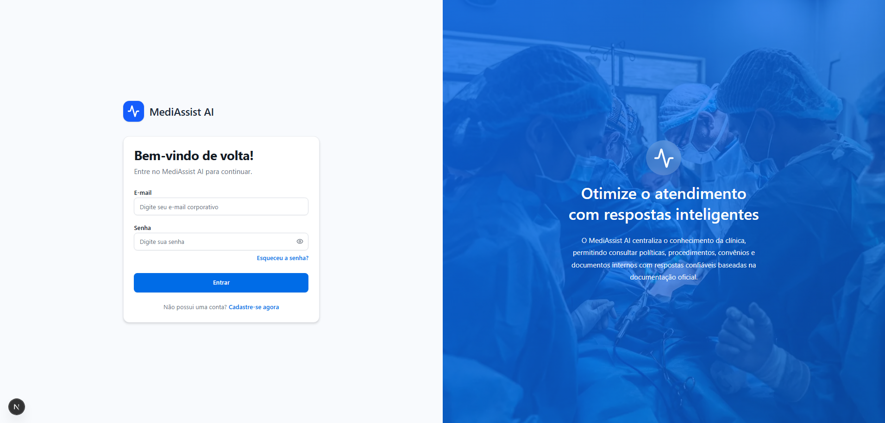
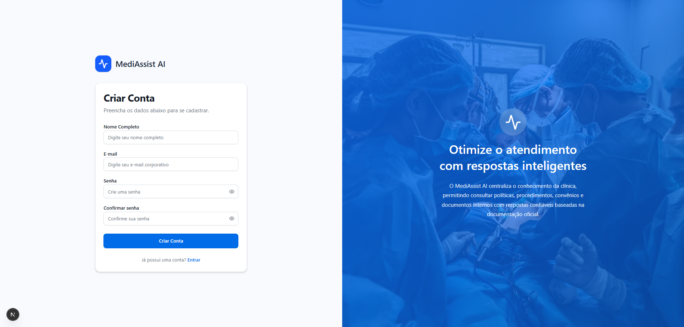
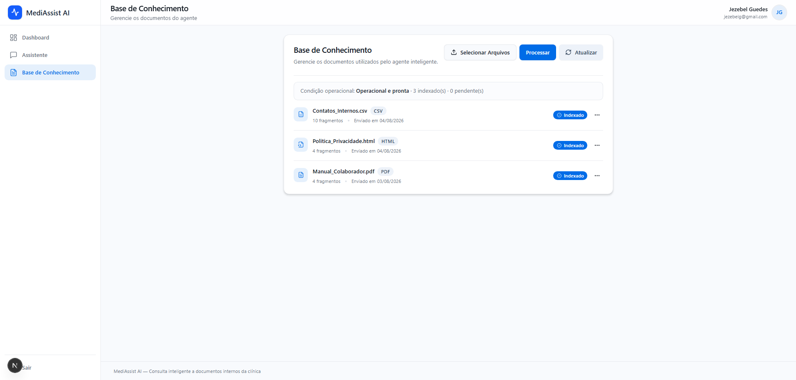
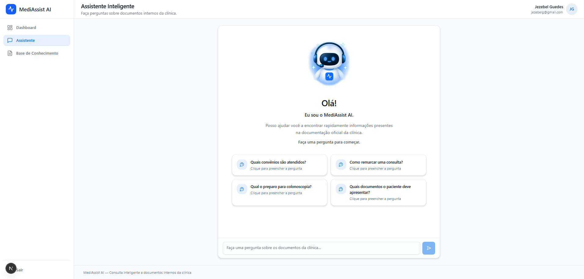
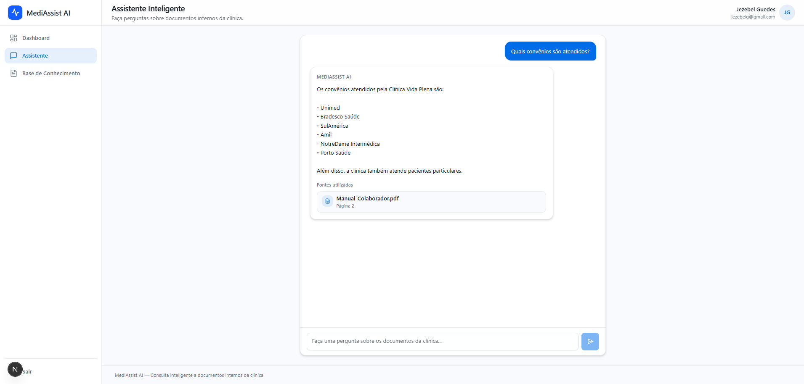

# MediAssist AI

MediAssist AI é uma plataforma web desenvolvida para auxiliar colaboradores de clínicas e consultórios médicos no acesso rápido e preciso a documentos internos utilizando Inteligência Artificial Generativa.

A solução utiliza a arquitetura **RAG (Retrieval-Augmented Generation)** para responder a perguntas em linguagem natural com base em documentos corporativos previamente processados, reduzindo o tempo gasto na busca manual por informações e centralizando o conhecimento organizacional em um ambiente seguro e intuitivo.

O projeto foi desenvolvido como parte do **Challenge Alura Agentes**, demonstrando a construção completa de um agente inteligente corporativo utilizando **Next.js 15**, **FastAPI**, **LangChain**, **FAISS** e **OpenRouter**.

---

# Arquitetura e Fluxo RAG

```text
                                 ┌───────────────────────────┐
                                 │    Usuário / Cliente      │
                                 └─────────────┬─────────────┘
                                               │
                                               ▼
                                 ┌───────────────────────────┐
                                 │   Next.js 15 (Frontend)   │
                                 └─────────────┬─────────────┘
                                               │ (HTTP / REST)
                                               ▼
                                 ┌───────────────────────────┐
                                 │     FastAPI (Backend)     │
                                 └─────────────┬─────────────┘
                                               │
        ┌──────────────────────┬───────────────┴───────────────┬──────────────────────┐
        ▼                      ▼                               ▼                      ▼
┌──────────────┐     ┌───────────────────┐           ┌───────────────────┐    ┌──────────────┐
│ Autenticação │     │ Base de Conhecimento │     │ LangChain + FAISS │    │  OpenRouter  │
│ (SQLAlchemy) │     │ (Upload/Gestão)   │           │ (Busca Semântica) │    │  (LLM Models)│
└──────────────┘     └───────────────────┘           └───────────────────┘    └──────────────┘
                                                                                      │
                                                                                      ▼
                                                                           ┌───────────────────┐
                                                                           │Resposta Inteligente│
                                                                           └───────────────────┘
```

---

# Estrutura do Monorepo

```text
mediassist-ai/
├── apps/
│   ├── web/                         # Frontend Next.js 15 (App Router)
│   │   ├── app/                     # Rotas: /login, /register, /dashboard, /dashboard/knowledge, /dashboard/chat
│   │   ├── components/              # Componentes React (auth, dashboard, documents, chat, ui)
│   │   ├── hooks/                   # Custom Hooks (useAuth, useChat, etc.)
│   │   ├── lib/                     # Utilitários e configurações de cliente
│   │   ├── services/                # Camada de integração com as APIs REST
│   │   ├── styles/                  # Estilos globais e Tailwind CSS
│   │   ├── types/                   # Definições de tipos TypeScript
│   │   └── public/                  # Assets estáticos, capturas de tela e demo-documents/
│   │       └── demo-documents/      # Documentos de demonstração (PDF, JSON, CSV, HTML)
│   │
│   └── api/                         # Backend FastAPI (Python 3.12+)
│       ├── app/
│       │   ├── api/                 # Endpoints HTTP (auth, documents, chat, rag, health)
│       │   ├── core/                # Configurações, segurança e variáveis de ambiente
│       │   ├── database/            # Conexão e sessão SQLAlchemy (SQLite/PostgreSQL)
│       │   ├── models/              # Modelos de dados (User, Document)
│       │   ├── modules/             # Módulos de domínio (auth, documents, rag, chat)
│       │   ├── repositories/        # Camada de acesso ao banco de dados
│       │   ├── schemas/             # Schemas Pydantic para validação das requisições
│       │   └── services/            # Serviços de integração (LLM, Embeddings, FAISS)
│       ├── storage/                 # Armazenamento de arquivos e índice FAISS persistido
│       ├── requirements.txt         # Dependências Python
│       └── .env.example             # Modelo de variáveis de ambiente do backend
│
├── packages/                        # Pacotes compartilhados reservados para expansão
├── package.json                     # Scripts do monorepo (pnpm workspaces)
├── pnpm-workspace.yaml              # Configuração do pnpm workspace
├── pyrightconfig.json               # Configuração do Pyright para o backend Python
└── README.md                        # Documentação principal do projeto
```

---

# Tecnologias Utilizadas

| Camada | Tecnologias |
| :--- | :--- |
| **Monorepo** | pnpm Workspaces |
| **Frontend** | Next.js 15 (App Router), React 19, TypeScript |
| **Interface & UI** | Tailwind CSS v4, shadcn/ui, Lucide React |
| **Notificações** | Sonner (Toasts interativos) |
| **Backend** | FastAPI, Python 3.12+, SQLAlchemy, Pydantic v2 |
| **Orquestração RAG** | LangChain, LangChain Community, LangChain Text Splitters |
| **Modelos de Linguagem** | OpenRouter (Modelos gratuitos e corporativos) |
| **Busca Vetorial** | FAISS (`faiss-cpu`) |
| **Processadores de Documentos** | `pypdf`, `pandas`, `openpyxl`, `docx2txt`, `python-pptx`, `unstructured`, `markdown` |

---

# Funcionalidades Implementadas

## 1. Autenticação e Gestão de Acesso
- Registration (Cadastro de novos colaboradores).
- Login com suporte a credenciais seguras.
- Logout e controle de sessão autenticada.
- Topbar e Sidebar personalizadas com nome, e-mail e avatar do usuário logado.

## 2. Dashboard Informativo
- **Documentos Indexados**: Total de arquivos disponíveis para consulta.
- **Fragmentos de texto**: Total de trechos (chunks) extraídos e vetorizados na Base de Conhecimento.
- **Condição operacional**: Status da sincronização e integridade do índice vetorial (`Operacional`, `Pendente`, `Vazio`, `Atenção`).
- **Última Atualização**: Data e hora da última sincronização no fuso horário `America/Sao_Paulo`.
- **Filtro por formato**: Filtro dinâmico para visualização rápida por tipo de arquivo (PDF, JSON, CSV, HTML, TXT, etc.).

## 3. Base de Conhecimento (Gestão de Documentos)
- **Upload de Documentos**: Suporte a envio de múltiplos arquivos simultaneamente.
- **Processamento e Indexação**: Botão **Processar** para extração de texto, geração de fragmentos e vetorização.
- **Atualização da Base**: Botão **Atualizar** para sincronizar e recriar o índice FAISS quando necessário.
- **Renomeação**: Edição simples do nome do documento diretamente na interface.
- **Exclusão de Documentos**: Remoção com atualização automática do índice FAISS e exclusão do armazenamento.
- **Badges e Feedback**: Indicadores visuais de formato, status (`Indexado`, `Processado`, `Pendente`, `Erro`) e toasts de confirmação.

## 4. Assistente Inteligente (Chat RAG Conversacional)
- Conversa fluida em linguagem natural.
- Recuperação de contexto semântico utilizando LangChain + FAISS.
- Citação de fontes com indicação precisa de documentos e páginas consultadas.
- **Tratamento gracioso**: Respostas amigáveis quando o assunto não estiver presente na Base de Conhecimento (sem alucinações).
- **Indicadores interativos**: Animação do avatar do assistente durante o processamento e resposta em tempo real.

---

# Fluxos da Aplicação

```text
                            ┌───────────────┐
                            │   Cadastro    │
                            └───────┬───────┘
                                    │
                                    ▼
                            ┌───────────────┐
                            │     Login     │
                            └───────┬───────┘
                                    │
                                    ▼
                            ┌───────────────┐
                            │   Dashboard   │
                            └───────┬───────┘
                                    │
           ┌────────────────────────┴────────────────────────┐
           ▼                                                 ▼
┌──────────────────────┐                          ┌────────────────────┐
│ Base de Conhecimento │                          │Assistente (Chat RAG)│
└──────────┬───────────┘                          └──────────┬─────────┘
           │                                                 │
           ├── Upload de Arquivos                            ├── Pergunta do Usuário
           ├── Processar (Geração de Fragmentos)             ├── Busca Vetorial no FAISS
           ├── Atualizar (Recriar Índice)                    ├── Contexto + Prompt RAG
           ├── Renomear Documento                            ├── Requisição OpenRouter
           └── Excluir Documento                             └── Resposta com Fontes
```

---

# Documentos de Demonstração

O projeto inclui documentos de exemplo pré-configurados para facilitar o teste imediato da Base de Conhecimento.

**Localização no projeto:**
```text
apps/web/public/demo-documents/
```

| Arquivo | Formato | Descrição do Conteúdo |
| :--- | :--- | :--- |
| **`Manual_Colaborador.pdf`** | PDF | Regras internas, horários, procedimentos de férias, código de conduta e benefícios da clínica. |
| **`FAQ_Clinica.json`** | JSON | Perguntas frequentes sobre agendamentos, convênios aceitos, cancelamentos e atendimento. |
| **`Contatos_Internos.csv`** | CSV | Tabela com ramais, telefones, e-mails e responsáveis pelos setores da clínica. |
| **`Politica_Privacidade.html`** | HTML | Termos de privacidade, diretrizes da LGPD, segurança de dados de pacientes e contatos DPO. |

---

# Exemplos de Perguntas para Testes

### Testando com `Manual_Colaborador.pdf`
- *Como funciona o procedimento para solicitação de férias?*
- *Qual é a política sobre banco de horas e horas extras?*
- *Como devo proceder em caso de registro de incidentes internos?*
- *Qual é o horário de atendimento e expediente corporativo?*

### Testando com `FAQ_Clinica.json`
- *Quais são os convênios médicos aceitos pela clínica?*
- *Como o paciente pode realizar o cancelamento ou reagendamento de uma consulta?*
- *A clínica realiza atendimento por telemedicina/teleconsulta?*
- *Quais documentos o paciente deve trazer na primeira consulta?*

### Testando com `Contatos_Internos.csv`
- *Qual é o telefone e o responsável pelo setor de TI?*
- *Quem é a responsável pelo setor de Enfermagem e qual o seu ramal?*
- *Qual o e-mail de contato da Recepção e do Financeiro?*
- *Qual o horário de atendimento do Laboratório?*

### Testando com `Politica_Privacidade.html`
- *Como a clínica garante a proteção dos dados pessoais de acordo com a LGPD?*
- *Quais são os direitos dos titulares de dados segundo a política da empresa?*
- *Como posso entrar em contato com o Encarregado de Proteção de Dados (DPO)?*
- *Os dados de saúde são compartilhados com empresas parceiras?*

---

# Requisitos do Ambiente

- **Node.js**: v20.0.0 ou superior
- **pnpm**: v9.0.0 ou superior
- **Python**: v3.12 ou superior
- **Chave de API**: OpenRouter API Key ([Obter chave no OpenRouter](https://openrouter.ai/))

---

# Guia de Instalação

### 1. Clonar o Repositório
```bash
git clone https://github.com/Jezebel1990/mediassist-ai.git
cd mediassist-ai
```

### 2. Instalar Dependências do Monorepo e Backend
Execute o script unificado na raiz do projeto:
```bash
pnpm install:all
```
*Este comando instala os pacotes Node.js no frontend, cria o ambiente virtual Python (`apps/api/.venv`) e instala as dependências declaradas em `requirements.txt`.*

### 3. Configurar Variáveis de Ambiente
Copie o arquivo de exemplo para criar o `.env` do backend:
```bash
cp apps/api/.env.example apps/api/.env
```

Edite o arquivo `apps/api/.env` e insira sua chave da OpenRouter:
```env
OPENROUTER_API_KEY=sk-or-v1-sua-chave-aqui
MODEL_NAME=meta-llama/llama-3.3-70b-instruct:free
```

---

# Instruções de Execução

Você pode executar o frontend e o backend simultaneamente ou em terminais separados.

### Opção A: Execução em Terminais Separados (Recomendado)

**Terminal 1 — Backend FastAPI:**
```bash
pnpm dev:api
```
- API disponível em: `http://localhost:8000`
- Swagger / Documentação OpenAPI: `http://localhost:8000/docs`
- Health Check: `http://localhost:8000/health`

**Terminal 2 — Frontend Next.js:**
```bash
pnpm dev:web
```
- Aplicação Web disponível em: `http://localhost:3000`

---

# Estrutura da Base de Conhecimento e Pipeline RAG

O processamento de documentos ocorre através de um pipeline estruturado:

```text
┌────────────────┐     ┌───────────────────────┐     ┌────────────────────────┐
│ Documento enviado │ ──► │ Extração & Loader     │ ──► │ Divisão em Fragmentos  │
│ (PDF, JSON, CSV)│     │ (LangChain Loaders)   │     │ (RecursiveTextSplitter)│
└────────────────┘     └───────────────────────┘     └───────────┬────────────┘
                                                                 │
                                                                 ▼
┌────────────────┐     ┌───────────────────────┐     ┌────────────────────────┐
│ Resposta RAG   │ ◄── │ Recuperação Semântica │ ◄── │ Embeddings & FAISS     │
│ (OpenRouter)   │     │ (FAISS Vector Store)  │     │ (HuggingFace/OpenAI)   │
└────────────────┘     └───────────────────────┘     └────────────────────────┘
```

---

# Tratamento de Erros e Resiliência

A aplicação foi projetada para garantir estabilidade e alta usabilidade:

- **Perguntas Fora de Escopo / Sem Contexto**: Quando a Base de Conhecimento não contém a resposta, o sistema responde educadamente sem gerar alucinações nem falhar a requisição HTTP.
- **Erros de Conexão com LLM**: Exceções no OpenRouter são tratadas no backend, retornando orientações claras para o usuário.
- **Feedback em Tempo Real**: Toasts informativos (Sonner) alertam sobre status de upload, atualizações de índice e eventuais falhas.

---

# Capturas de Tela

### 1. Autenticação (Login e Cadastro)



### 2. Base de Conhecimento (Gestão de Documentos e Fragmentos)


### 3. Assistente Inteligente (Chat RAG e Fontes Consultadas)



---

# Observações Finais

- O projeto segue a arquitetura monorepo gerenciada por **pnpm Workspaces**.
- O diretório `packages/` está configurado para abrigar futuras bibliotecas compartilhadas.
- Todo o processamento de datas e logs da aplicação segue o fuso horário corporativo `America/Sao_Paulo`.
- Os documentos da pasta `apps/web/public/demo-documents/` podem ser carregados diretamente pela interface para testes imediatos.

---

# Licença

Projeto desenvolvido para fins educacionais e de demonstração prática como parte do **Challenge Alura Agentes**.